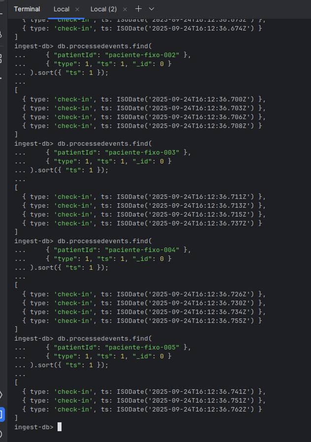
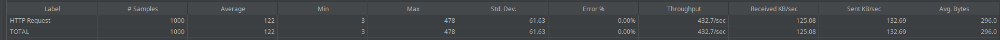

# Event Ingestor Service

This project implements a high-performance event ingestion service, designed to be resilient, scalable, and fault-tolerant. The application is built with **NestJS**, leveraging **Kafka** as a message broker and **MongoDB** for data persistence, all orchestrated with **Docker Compose**.

The system is capable of receiving a high volume of events via an HTTP endpoint, processing them asynchronously, and ensuring in-order processing per patient, even under heavy load.

## Core Features

*   **Asynchronous Ingestion:** The API endpoint responds in milliseconds by queuing events in Kafka for background processing.
*   **Ordered Processing:** Guarantees that events for the same `patientId` are processed in the order they are received.
*   **Idempotency:** Processing the same event multiple times produces the same result as processing it once, preventing data duplication.
*   **Fault Tolerance:** The system is designed to prevent event loss, even if the processing service fails and restarts.
*   **Horizontal Scalability:** The architecture allows for scaling out the number of workers to increase processing throughput as demand grows.
*   **API Documentation:** The API is self-documented using Swagger (OpenAPI), available at `http://localhost:3000/api-docs`.

## Solution Architecture

To meet the requirements of high throughput and slow processing (~5s per event ), an event-driven architecture was implemented:

1.  **API (Producer):** A `POST /events` endpoint in NestJS receives the request. Its sole responsibility is to validate the payload and immediately publish it to a Kafka topic.
2.  **Message Broker (Kafka):** Acts as a durable and scalable buffer, decoupling the ingestion layer from the processing layer. The `patientId` is used as the partition key to guarantee ordering.
3.  **Worker (Consumer):** A background process (within the same NestJS service) consumes messages from the Kafka topic, executes the 5-second business logic, and persists the result to MongoDB.


## Tech Stack

*   **Backend:** NestJS (TypeScript)
*   **Database:** MongoDB
*   **Messaging:** Apache Kafka (in KRaft mode)
*   **Containerization:** Docker & Docker Compose
*   **Validation:** `class-validator`, `class-transformer`
*   **API Documentation:** Swagger (OpenAPI)

## Getting Started

### Prerequisites

*   Docker
*   Docker Compose

### Running the Project

1.  **Clone the repository:**
    ```bash
    git clone https://github.com/joao21dev/event-ingestor.git
    cd event-ingestor
    ```

2.  **Build and start the containers:**
    ```bash
    docker-compose up --build
    ```

3.  **Access the application:**
    *   **API Endpoint:** The service is available at `http://localhost:3000`.
    *   **API Documentation (Swagger ):** `http://localhost:3000/api-docs`.

## Validation Tests (JMeter )

A series of tests were conducted using Apache JMeter to validate the core non-functional requirements of the system.

### Test 1: In-Order Processing per `patientId`

This test validates that events for the same patient are processed in the correct order.

*   **Methodology:** A JMeter script sent a rapid sequence of events for a single `patientId` (`paciente-fixo-001`), each with a unique, chronologically increasing timestamp.
*   **Verification:** After processing, a query was run against the MongoDB database, filtering by the test `patientId` and sorting by the `ts` field.
*   **Result:** The query results show that the events were persisted in the exact order they were sent, confirming that Kafka's partitioning strategy correctly maintained the processing order.



### Test 2: Idempotency

This test validates that processing an identical event multiple times does not create duplicate records.

*   **Methodology:** A JMeter script sent the exact same request (same `patientId` and a **fixed** `ts`) multiple times to the API.
*   **Verification:**
    1.  The API accepted all requests, responding with `202 Accepted`.
    2.  The service logs show that only the first event was fully processed, while subsequent identical events were identified as duplicates and discarded.
    3.  A `countDocuments` query in MongoDB confirmed that only a single record was created for the event.
*   **Result:** The system correctly enforces idempotency at the consumer level, preventing data duplication without impacting the availability of the ingestion API.

| JMeter Final Report (15 Samples) | MongoDB Final Count (13 Documents) |
| :---: | :---: |
|  |  |


### Test 3: Load Test (1000 Events Burst)

This test validates the API's ability to handle a sudden burst of traffic, simulating the "1000 events/min" requirement.

*   **Methodology:** A JMeter script was configured with 100 threads and a loop count of 10, firing a total of **1000 requests** in a very short period (ramp-up of 1 second).
*   **Verification:** The JMeter `Summary Report` was analyzed to check the API's performance under stress.
*   **Result:** The API successfully handled all 1000 requests with **0% errors** and an average response time in the low milliseconds. This demonstrates that the ingestion layer can easily absorb high-volume bursts, queuing them safely in Kafka for the workers to process asynchronously.



## Scalability Analysis

The "1000 events/min" requirement was addressed on two fronts: **ingestion capacity** and **end-to-end processing throughput**.

1.  **Ingestion Capacity:** The API endpoint is designed to be asynchronous and non-blocking. As validated by the load test, the API can handle a request rate far exceeding 1000/min with average response times in the low milliseconds.

2.  **Processing Throughput:** The end-to-end processing, which includes the 5-second simulated delay, is the system's bottleneck. To achieve a throughput of 1000 events/min, the architecture is designed for horizontal scaling. By using **10 partitions** in the Kafka topic, we can scale out to **10 parallel workers**, achieving a theoretical processing capacity of **1200 events/min**, which satisfies the requirement.

    *   **Capacity Calculation:** (1 event / 5 sec) * 60 sec/min = 12 events/min per worker.
    *   **Total Capacity:** 12 events/min/worker * 10 workers = 1200 events/min.

## Future Improvements

While the current solution is robust, several areas could be enhanced in a production environment:

1.  **Dead Letter Queue (DLQ):** Implement a DLQ topic in Kafka to handle "poison pill" messages that repeatedly fail processing, preventing them from blocking a partition.
2.  **Monitoring and Observability:** Integrate tools like **Prometheus** and **Grafana** to expose application and Kafka metrics for real-time health monitoring.
3.  **Advanced Retry Logic:** Implement an exponential backoff strategy in the Kafka consumer to handle transient failures more gracefully.
4.  **Automated Testing:** Add a comprehensive suite of unit and integration tests (`testcontainers`) to validate the system's behavior in a CI/CD pipeline.
